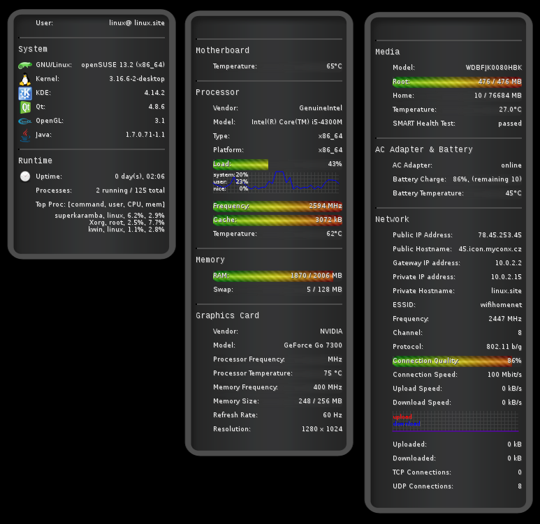

# Linux SuperKaramba system monitor

Easily customizable system monitor for KDE4 SuperKaramba.

#### What is SuperKaramba?

[SuperKaramba](https://techbase.kde.org/Development/Tutorials/SuperKaramba):
> KDE's SuperKaramba is a tool that allows one to easily create functionality enhancement modules on a KDE desktop. Such modules are interactive programs written
 in Python, Ruby or KDE JavaScript that are usually embedded directly into the background and do not disturb the normal view of the desktop.

[Opensuse SuperKaramba package](https://software.opensuse.org/package/superkaramba):
>Superkaramba allows you to have (interactive) desktop widgets shown on
your desktop.

The system monitoring widgets from this project look like on the following screenshot:

## Usage
- install SuperKaramba package into your KDE desktop (installation depends on the distro you use)
- download the widgets with the image resources and copy onto your computer
- import the widgets into SuperKaramba

## Customizing sensors
Customizing/enhancing is pretty straightforward, see the source of widgets, it's self explanatory :) You may add any result of inline bash script into a widget.

You can add, update, delete already provided sensors to fit your needs. Currently not all the commands are generic enough. Feel free to change any command,
 most of sensors are just standard bash commands.

You may add also new section, for instance display weather forecast or to monitor any other system component currently not monitored, just add new group/row,
 image, text description and appropriate command.

## Contribution
Feel free to fork project or fill in issue with proposed new commands, generic commands, more efficient extracting of system info etc.

## Roadmap
As SuperKaramba is not anymore under development (replaced by Plasma) then no further enhancements will be done.

See [KDE Community Announcements - KDE Ships KDE Applications 15.12.0](https://www.kde.org/announcements/announce-applications-15.12.0.php):

> As part of the effort to modernise our offerings, we've dropped some applications from KDE Applications and are no longer releasing them as of KDE Applications 15.12
We've dropped 4 applications from the release - Amor, KTux, KSnapshot and SuperKaramba. As noted above, KSnapshot has been replaced by Spectacle, and Plasma essentially replaces SuperKaramba as a widget engine. We've dropped standalone screensavers because screen locking is handled very differently in modern desktops.

## Credits

Based on system monitor by Edward (Ede) Somorjai, 2007-02-25.

## Links
- [SuperKaramba Development Tutorial](https://techbase.kde.org/Development/Tutorials/SuperKaramba)
- [SuperKaramba GitHub repository](https://github.com/KDE/superkaramba)
- [SuperKaramba SourceForge repository](http://netdragon.sourceforge.net/ssuperkaramba.html)
- [SuperKaramba/Sensors](http://netdragon.sourceforge.net/ssensors.html)
- [Opensuse SuperKaramba package](https://software.opensuse.org/package/superkaramba)
- [KDE Community Announcements - KDE Ships KDE Applications 15.12.0](https://www.kde.org/announcements/announce-applications-15.12.0.php)